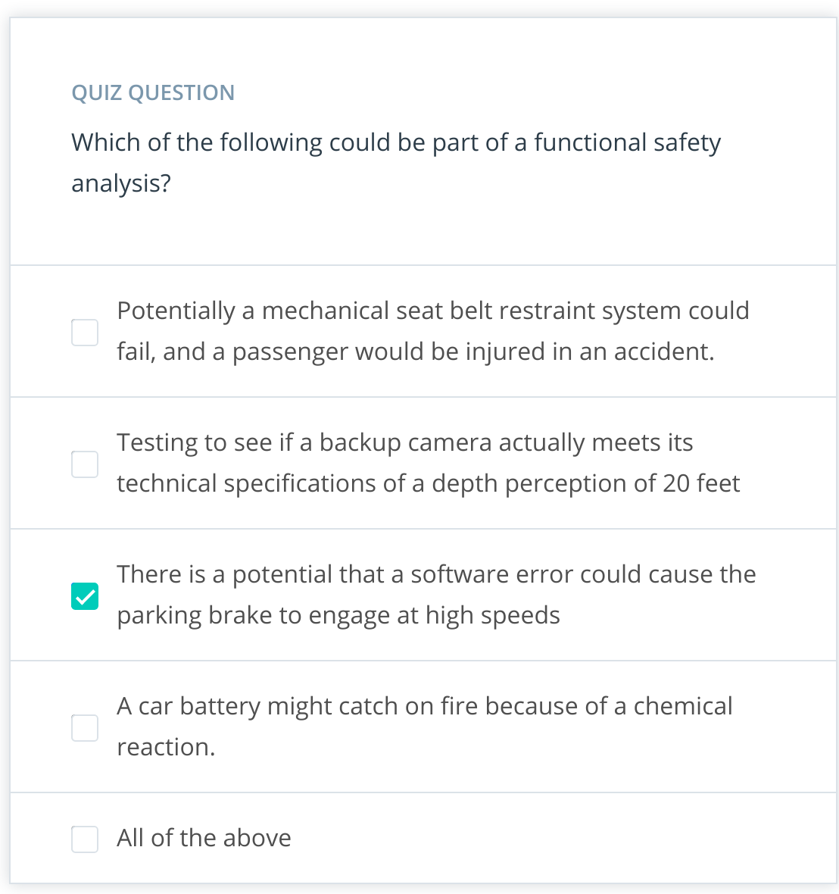
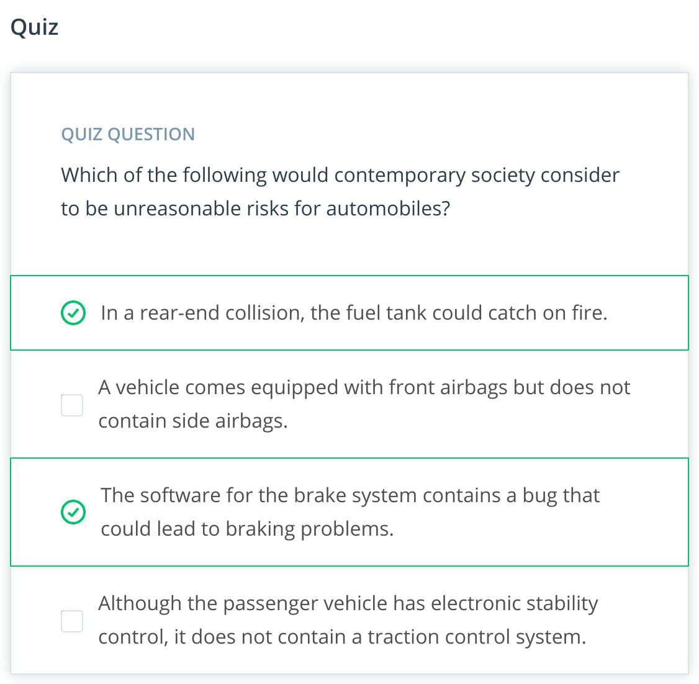
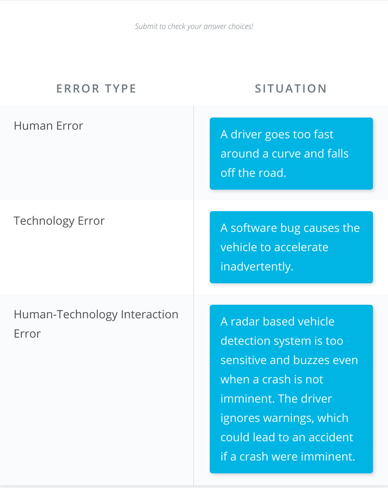
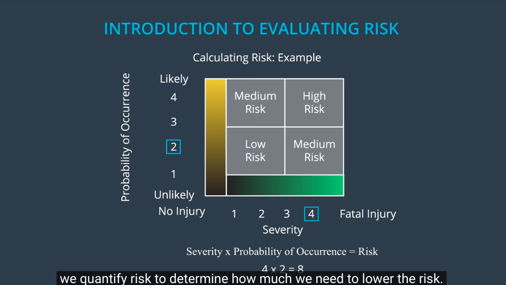
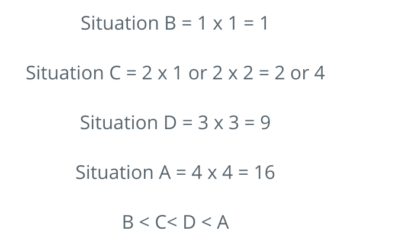

# Lesson 08: Introduction to Functional Safety 

# 01. Introduction to Functional Safety 

* Elektrobit
* ISO26262 - Functional Safety
* Stephanie Hollyer: Validation and Verification Manager, Elektrobit US
* Benjamin Brentrop: Functional Safety Manager, Elektrobit DE 
  * Background in automotive systems SW development
  * Functional Safety for Instrument Clusters, Transmission Control, AirBag Control, and Body Control Units
* Dheeraj Sharma: Senior SW Engineer at Elektrobit 

Notes: 
* The video uses the term "safe and functional" . The preferred terminology is "functionally safe."
* Functional safety is not specific to the automotive industry and is applied to multiple industries including industrial process, industrial machinery, rail, aviation and others.

# 02. Introduction to the Lesson 

* FuSa (Functional Safety) in Automotive industry **specifically** refers to safety of Electronic and Electric **(EE) systems**. 

* It was developed because of increasing use of complex HW and SW system in passenger vehicles. 

* **ISO 26262** is the main standard for FuSa in automotive industry
* It uses systems engineering to **methodically** reduce risk in EE systems of passenger vehicles
* We will start with the **general introduction to automotive safety** and and present **the basic building blocks for carrying a functional safety analysis** according to ISO standard. 

* **Note** that functional safety and ISO 26262 do **not** consider **all risk in E/E systems**. They **only** consider reducing **risk as a result of malfunctioning behavior** of E/E systems.

* The **most generic standard** is International Electrotechnical Commission [**IEC 61508**](https://www.iec.ch/safety), which originated from industrial markets. It currently exists as a standard in the **IEC/ISO basic safety publication**, which covers **"general functional safety,"** for a number of industries. **ISO 26262 specifically applies to automotive passenger vehicle electrical and electronic systems**. The ISO 26262 standard is an offshoot of the IEC 61508 standard.

* **Note** that what is described in this video and the lessons that follow encompasses not only **FUSA** (**functional safety**) but also **Safety of the Intended Functionality** (**SOTIF**).

# 03. What is Safety

* **Risk Tolerance**. Different people have different levels of risk tolerance. What is safe for someone, may not seem safe for someone else. 

* Different systems in a vehicle such as hydraulic, mechanical, electrical, electronic, and chemical are covered by a variety of automotive standards about safety and also design best practices. You can find some examples on the [Society of Automotive Engineers website](https://www.sae.org/standards/).
* Governments even have their own safety standards such as the United States government's [Federal Motor Vehicle Safety Standards](https://icsw.nhtsa.gov/cars/rules/import/FMVSS/) and the United Nation's [World Forum for Harmonization of Vehicle Regulation](https://unece.org/transportvehicle-regulations/wp29-world-forum-harmonization-vehicle-regulations-wp29).

* **Functional safety**, which **only looks at electrical and electronic system malfunctions**, is just one part of overall vehicle safety. 

### Functional Safety and Nominal Performance
* Functional safety also **does not look at nominal performance**. For example, nominal performance of an automatic braking system could be that a vehicle traveling 60 miles per hour should come to a complete stop in 5 seconds. Functional safety does not determine whether or not the vehicle brakes within 5 seconds.

* Instead, **functional safety would look at malfunctions** like if the braking function engaged when it wasn't supposed to or if the system brakes too hard causing injury to the driver. Nominal performance issues can still lead to safety problems, but nominal performance is not part of the functional safety standard.

# What is Functional Safety

* In FuSa, our goal is to 
  * Identify high risk situations 
  * Lower the risk to reasonable levels. 

* Safety = **Absence of unreasonable risk**
* **Functional Safety** at its most basic levels **involves three main things**: 
  1. Identify Hazards (potential problems that could injure people and cause damage to their health)
  2. Evaluate the risk of hazards
  3. Using systems engineering to lower the risks.  

* In practice the third part takes most time and will be the main focus of these functional safety lessons
* Lowering risks involves **designing safe systems**, **testing** the system, and **documenting** designs and tests. 

### The Basics of Functional Safety: Review
1. **Identify hazards** in a passenger vehicle's electronic or electric system that could cause physical injury or damage to a person's health
2. **Evaluate the risk** of the hazardous situation so that we know how much we need to lower the risk
3. Via **systems engineering**, prevent accidents from occurring by **lowering risk** to reasonable levels. Systems engineering helps you figure out what your vehicle needs to do and what your vehicle design needs to look like in order to remain safe.

### What Level of Risk is Reasonable?
**Who gets to decide what level of risk is reasonable?**

While you can never eliminate risk entirely, you will reduce risk to levels acceptable by **society as a whole**.

The **history of seat belts** provides **a great example of how society measures risks**. As an aside, remember that functional safety only looks at malfunctions related to electrical and electronic systems. Although seat belts are important safety features, they would not be considered part of automotive functional safety since seat belts are mechanical devices. For our purposes we will consider seat belts to be mechanical. Some modern seat belts, which are not purely mechanical, and contain electrical components, would be considered part of functional safety.

Many people consider Karl Benz to have invented the **automobile** around **1885**. **Seat-belts didn't start appearing until** the **1920s** when **doctors began installing them in their own vehicles**. It wasn't until the **1950s** that car companies offered seat belts as **optional equipment**. And then it took **until the end of the 1950s** for seat belts to **become standard equipment**.

In **1968**, the **United States passed legislation requiring all vehicles to come with safety belts**. Then in **1970**, **Australia became the first country to require seat belt use**. In **1984**, **New York was the first state in the United States to pass similar legislation**. So it took **almost a century for countries to require seat belt use**.

Today, can you imagine purchasing a car with no seat belts? **By the measure of contemporary society, driving without a seatbelt is an unreasonable risk**. But **in the past**, driving without a seatbelt **was considered reasonable** by society's standards.

Functional safety **focuses on keeping risks below society's current threshold**.

### Eliminating Risk Completely
Why are you only trying to lower risk to reasonable levels rather than eliminating all risk? Eliminating all risks would paralyze engineering, product development and testing. Ensuring that people were never injured in a car accident would, unfortunately, probably be impossible.

On the other hand, not **eliminating enough risks** could lead to failed products, recalls, lawsuits or even loss of life. In the end, **every company has to decide for itself how much risk to eliminate from its products**.

### What does "Functional" Mean?
The term "**functional**" comes from a branch of systems engineering called **requirements engineering**. Systems engineering separates requirements into:

**Functional requirements** - *_ **what** your system is supposed to **do** ?*; in other words, the system's functions.

**Non-functional requirements** - *_ **how** the system should **behave** ?*: for example, how reliable is the system?

Functional requirements generally have the form **X system shall *do* Y**. For example, "The turn signal system shall turn on an indicator light telling the driver that the system is active".

Non-functional requirements have the form **X system shall *be* Y**. As an example: "The turn signal system shall be available when the vehicle ignition switch is in the on position".

**Functional safety looks at** what happens when the system does something that it was not supposed to do, which is called a **malfunction**. You will be adding new engineering requirements to the vehicle design in order to ensure safe systems.

You might notice that the word *shall* comes up quite often in the functional safety module. This is because engineering requirements almost always contain the word "shall". If you see the word shall, then you are probably looking at an engineering requirement.

# 05. Introduction to Identifying Hazards

* Main goals of functional safety: 
  * Identifying hazards, and 
  * Lowering risks to acceptable levels

* Many improvements in current vehicles are added as a result of injuries in past 

* In functional safety we want to identify hazards before they lead to harm or injury.

* How do we identify hazards? by **brainstorming**
* We take a cross-section of personal from the company: Project Managers, Designer, Test Engineer 
  * use brainstorming to imagine a lot of different scenarios and situations that could lead to accident

* To identify hazards, we look at three general causes of accident: 
  * Errors caused by humans, 
  * Errors from technology, 
  * Errors caused by Human-technology Interaction. 

* We will look at a more formal framework for identifying hazards in the following lessons. 

## Examples of human, technology, and human-technology interaction errors
Let's go through a real-world example of each type of error and see how they lead to accidents.

### Human Error
In February 2016, two trains collided head-on near Munich, Germany. Although that stretch of track had an automatic signaling system that should have stopped the trains, a human controller switched off the system because one of the trains was running late. This is an accident due to human error. As an engineer, you would try to figure out why the train controller turned off the system and what could have been done to avoid the situation.

Human error is especially important in the auto industry. In the United States, the National Highway and Transportation Safety Administration estimates that 94% of car accidents involve human error.

The European Union also estimates about 90% of vehicular accidents involve human error.

### Technology Error
For an example of technology causing accidents, consider the European Space Agency's Ariane 5 rocket. The rocket exploded during its first test flight on June 4th, 1996. Engineers had reused portions of the Ariane 4 software. The rocket exploded because the Ariane 5 required a 64-bit floating point value whereas the original software expected a 16-bit signed integer.

Software bugs are a major source of technology error throughout many industries including the car industry. An internet search of software bugs cars will give you a sense of how serious the issue is.

### Human-Technology Interaction Error
And finally, let's discuss how human-technology interaction causes accidents. Back in 2013, Asiana Flight 214 crashed when landing in San Francisco. A pilot selected an incorrect autopilot mode and inadvertently switched off the auto throttle function. The plane came in for landing at a very low speed and low altitude.

The pilots' over-reliance and misunderstanding of the automatic system contributed to the crash. The autopilot system should have included a warning telling the pilot that the automatic throttle was not maintaining enough speed.

Whenever a human and a machine share control of a system, extra care needs to be taken when evaluating safety; the boundary between what the human is supposed to do and what the machine is supposed to do needs to be clear.

As advanced driver-assistance systems (ADAS) become ubiquitous, human-technology interaction errors might become more prevalent. We as drivers need to understand the warning signals coming from our lane keeping assistance and automatic cruise control systems. Interfaces need to make it clear when the vehicle expects us to take over. And these needs to be analyzed as safety issues. The Asiana Flight 214 example we mentioned shows the consequences of a flawed human-technology system design.

Part of your job as a safety engineer will be to anticipate what will go wrong with a vehicle when the vehicle is still in the design phase. You will think about situations and conditions where humans, technology, and human-technology interaction can lead to dangerous situations and cause accidents. In other words, you will identify hazards.

## Errors and Self-Driving Cars
One of the aims of self-driving cars is to take humans completely out of the equation. The trade-off is that **autonomous vehicle** could introduce **more technology errors**.

Take a **machine learning algorithm** as an example. What happens if **a pedestrian training set** does not include pedestrians in **wheelchairs**? The system would not count a pedestrian in a wheelchair. **How accurate** do our results need to be on a validation set? Who determines what the training set needs to contain?

Autonomous vehicle technology is so new that standards like ISO 26262 do not yet even consider certain issues related to self-driving cars such as machine learning algorithms. But the **principles of functional safety, which uses systems engineering to identify and lower risks, apply to autonomous vehicles as well**!

Please note that the example above addresses nominal performance, which is more related to Safety of the Intended Function (**SOTIF**) then FuSa. The ISO 26262 committee is authoring a sister specification, **ISO 21448**, to **address nominal performance**.

Quiz
QUIZ QUESTION
Match the term on the left with the situation on the right

# 06.Sebastian and Technology Errors

* Power system of Stanly was working ok for months
* until summer hit
* beginning of summer, an alternator in the electrical vehicle system broke
* they changed it and it broke again two weeks later
* it is expensive, they change it, and again after two weeks it broke. 
* So, let's check the code
* It turns hour the code has a threshold of 12.5 Volt for detecting if the car is on or not. If car is on, the take power from car, otherwise from battery
* Now what happens: It is summer, they start the air conditions. It takes more voltage, the car voltage drops below 12.5. Teh algorithm switches to battery. The load is reduced on the car electric system, the voltage goes over 12.5. The algorithm switches to car electrical system. 
* Now alternating the power from car to battery, and then to the car, and then to battery ... in tenth of second. Just fried the alternator. 
* They tested the systems first with digital voltmeters, which smoothed the very fast oscillation. With analog voltmeter, it was dancing, low, high, low, high, low, high...
 
# 07. Introduction to Evaluating Risks
* Now that we have an idea about how to identify hazards, we need to evaluate the risk associated with each hazard. 
* Every hazard has a certain risk associated with it (high risk, low risk)
* We define risk numerically
* **Risk** = **Severity of harm x Probability of occurrence**
* **Severity of harm** measures how badly a person can get injured when an accident occurs. 
* **Probability of occurrence** has a specific definition for passenger car functional safety. It is the **frequency of typical drivers find themselves driving in a certain situation**. For example: Driving on a city street has a high probability, because people do it everyday (it is likely). Driving on a snowy mountain side, has a low probability, because people hardly find themselves driving in those conditions (it is unlikely). 
* **Probability of occurrence**, only takes into account how often you will find yourself in a certain situation. It **does not take into account how likely a malfunction** will occur, like the probability of your brakes failing. Failing brakes would lead to high severity, but will not affect the probability of occurrence. 
* Let's go through an example of calculating the risk: 
  * Let's say the severity has scale of 1 to 4, with 1 meaning not injury and 4 meaning fatal injury. 
  * Probability of occurrence with also have a scale of 1 to 4 with 1 being an unlikely scenario, like needing a jump start and 4 will be likely scenario like driving on a highway. 
  

* Now here is our scenario: You are driving on a snowy mountain side path, and the power steering malfunctions. 
  * Severity is 4: we could lose control of the vehicle and drive off the mountain side and suffer a fatal injury
  * Probability of occurrence could be 2, because you would not find yourself driving on a snowy mountain side very often. 
  * So, the Risk is 4 x 2 = 8 

* In functional safety analysis we quantify the risk, to determine how much we need to lower the risk. 

* Vehicle systems with high risk require more analysis and testing to bring the risk down to acceptable levels. 

## ASIL (Automotive Safety Integrity Level)
The **ISO 26262** standard defines a **risk factor** called **ASIL - Automotive Safety Integrity Level**. ASIL is **a four point scale** of ASIL **A**, ASIL **B**, ASIL **C** and ASIL **D**.

**ASIL D** represents a **hazardous situation** with the **highest risk** whereas **ASIL A** represents **lower risk**. ASIL is a key term in automotive functional safety. The video introduced the basic ideas behind how to calculate ASIL, but we will leave the details for the **Hazard Analysis and Risk Assessment** Lesson.

There is one more **level of risk below ASIL A** called **QM**. QM stands for **quality managed**. QM means that development according to accepted quality principles is sufficient to reduce risk. You will learn more about ASIL and QM in the lesson on hazard analysis and risk assessment.

**Quiz**

Let's measure probability of occurrence and severity on a scale from 1 to 4 with 4 representing highly probable and severe situations. Here are some guidelines for measuring probability of occurrence and severity:

Probability of occurrence:

1 - Vehicle jumpstart needed

2 - Driving in snow

3 - Driving at night with no street lamps

4 - Driving on the highway

Severity:

1 - No injury

2 - Light and moderate injury

3 - Severe and life threatening injuries with probable survival

4 - Life threatening injuries, survival uncertain, or fatal injury

Remember that: risk = probability of occurrence x severity

RANK THE FOLLOWING HAZARDOUS SITUATIONS FROM LEAST RISKY TO MOST RISKY

A While driving on the highway, brakes fail at high-speed.

B Your vehicle requires a jumpstart. The power steering is not working but the vehicle is parked on the side of the road and not moving.

C While driving in the snow in the city, anti-lock brakes fail while driving at low speed.

D While driving at night on a street with no street lamps, the car headlamps fail.

# 08. Reducing Risk with Systems Engineering

* Through out the Functional Safety module, we will use a lane assistance system as a practical example.
* A lane assistance system generally has two functions:
  * lane departure warning
  * lane keeping assistance

* If a driver departs a lane **without using a turn signal**, the **system assumes** that the driver has become distracted and did not mean to leave the lane. The **system will vibrate the steering** (lane departure **warning**) and also move the **steering wheel back towards the lane center** (lane keeping assistance).

